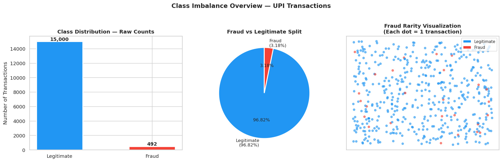
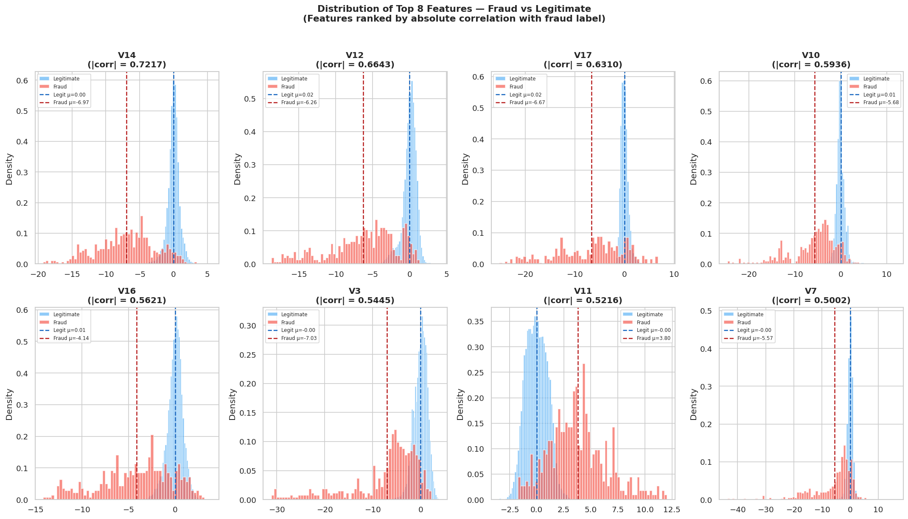
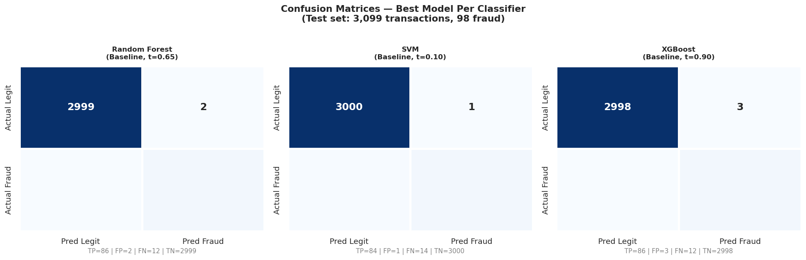
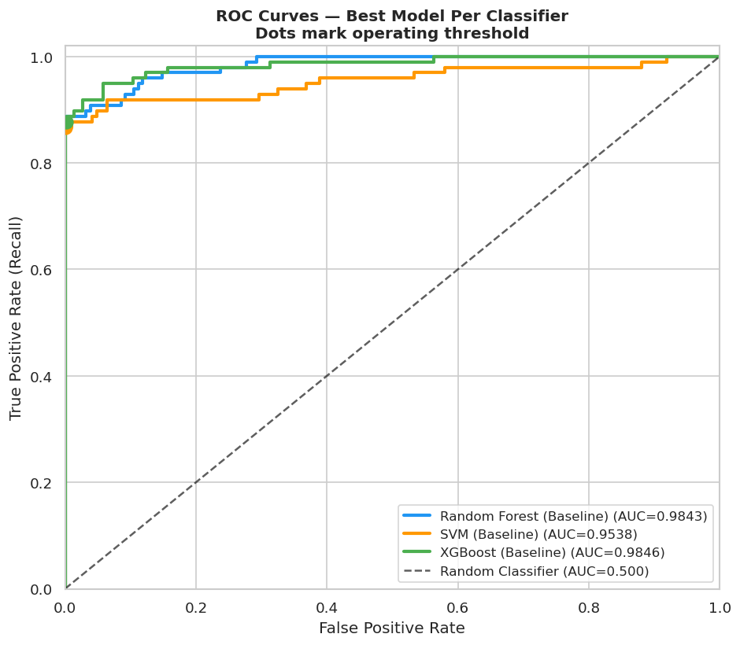
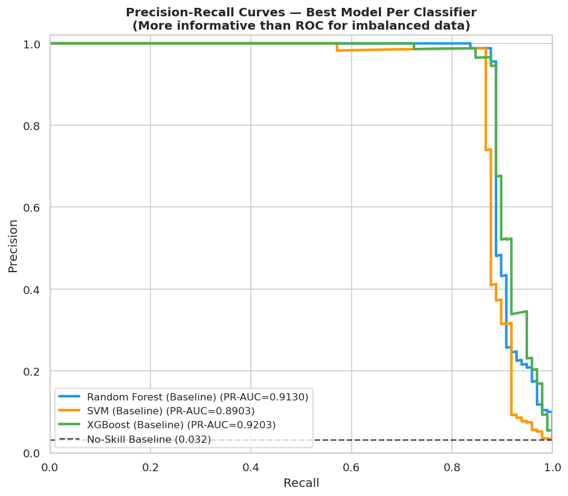
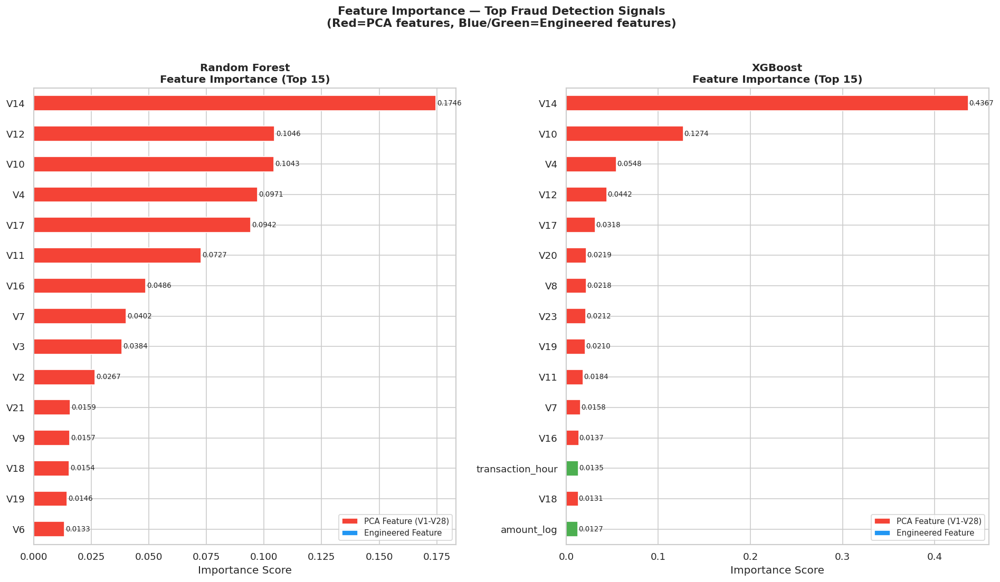

# 🔍 Imbalance-Aware ML for UPI Fraud Detection
### A Comparative Classifier Study

> Detecting fraudulent UPI transactions using machine learning — 
> comparing Random Forest, SVM, and XGBoost across four imbalance-handling 
> strategies on a 30:1 imbalanced dataset.

---

## 💼 Business Problem

India's Unified Payments Interface (UPI) has transformed digital payments, 
processing over 13 billion transactions monthly as of 2024. With this scale 
comes a critical challenge — financial fraud that exploits the speed and 
accessibility of the UPI ecosystem.

**The core problem is threefold:**

**1. Fraud is rare but costly**
Fraudulent transactions represent less than 4% of all UPI activity — but 
each missed fraud case results in direct financial loss to customers and 
erodes trust in the payment system. A model that catches nothing while 
scoring 96% accuracy is completely useless.

**2. Class imbalance makes standard ML fail**
With a 30:1 ratio of legitimate to fraudulent transactions, standard 
classifiers are heavily biased toward predicting everything as legitimate. 
Specialized imbalance-handling techniques are essential to build a model 
that actually detects fraud.

**3. False alarms are just as damaging**
A model that flags too many legitimate transactions as fraud creates a 
different problem — innocent customers get blocked, generating complaints 
and destroying user experience. The ideal fraud detector catches most 
fraudsters while almost never blocking legitimate users.

**This project directly addresses all three challenges** by building and 
comparing multiple ML classifiers with imbalance-handling strategies, 
evaluated on metrics that reflect real business costs — Recall (fraud 
missed = money lost), Precision (false alarms = customers blocked), 
and F1 (balance of both).

---

## 📌 Project Overview

This project conducts a systematic comparative study of three classifiers 
and four imbalance-handling strategies for UPI fraud detection, producing 
models that achieve **F1 > 0.92** with **false alarm rates below 0.1%**.

**Three Classifiers:**
- Random Forest — ensemble of decision trees, feature importance
- SVM (LinearSVC) — margin-based linear classifier
- XGBoost — gradient boosting, state-of-the-art on tabular data

**Four Imbalance Strategies:**
- Baseline — cost-sensitive learning via class_weight='balanced'
- SMOTE — Synthetic Minority Oversampling Technique
- ADASYN — Adaptive Synthetic Sampling
- SMOTE + Tomek Links — oversample then clean boundary noise

**Tuning:** RandomizedSearchCV + StratifiedKFold (k=5), scoring=F1

---

## 🛠️ Tech Stack

| Category | Library | Purpose |
|---|---|---|
| **Data** | pandas, numpy | Data manipulation and numerical operations |
| **Visualization** | matplotlib, seaborn, scipy | Charts, statistical plots, Mann-Whitney U tests |
| **ML Models** | scikit-learn | Random Forest, SVM(LinearSVC), preprocessing, metrics |
| **Boosting** | xgboost | XGBoost classifier with native imbalance support |
| **Imbalance** | imbalanced-learn | SMOTE, ADASYN, SMOTETomek resampling |
| **Tuning** | scikit-learn | RandomizedSearchCV, StratifiedKFold |
| **Calibration** | scikit-learn | CalibratedClassifierCV for SVM probabilities |
| **Persistence** | pickle | Model serialization and loading |

---

## 🎯 Results at a Glance

| Model | Strategy | Precision | Recall | F1 | ROC-AUC | PR-AUC | Caught |
|---|---|---|---|---|---|---|---|
| **Random Forest** | **Baseline** | **0.9773** | **0.8776** | **0.9247** | **0.9843** | **0.9130** | **86/98** |
| XGBoost | Baseline | 0.9663 | 0.8776 | 0.9198 | 0.9846 | 0.9203 | 86/98 |
| SVM | Baseline | 0.9882 | 0.8571 | 0.9180 | 0.9538 | 0.8903 | 84/98 |

> **Best Model:** Random Forest + Baseline — F1=0.9247, catching 86 of 
> 98 fraudsters with only 2 false alarms across 3,001 legitimate 
> transactions (0.067% false alarm rate)

---

## 📊 Key Visualizations

<table>
  <tr>
    <td><b>Class Imbalance</b></td>
    <td><b>Feature Distributions</b></td>
  </tr>
  <tr>
    <td></td>
    <td></td>
  </tr>
  <tr>
    <td><b>Confusion Matrices</b></td>
    <td><b>ROC Curves</b></td>
  </tr>
  <tr>
    <td></td>
    <td></td>
  </tr>
  <tr>
    <td><b>PR Curves</b></td>
    <td><b>Feature Importance</b></td>
  </tr>
  <tr>
    <td></td>
    <td></td>
  </tr>
</table>

---

## 🗄️ Dataset

The dataset contains **15,492 UPI transaction records** collected over 
a 48-hour period, comprising:

- **492 confirmed fraud cases (3.176%)** — minority class
- **15,000 legitimate transactions (96.824%)** — majority class
- **31 features** — 28 anonymized PCA behavioral features (V1-V28), 
  transaction amount (INR), transaction hour, and fraud label
- **Zero missing values** — clean and complete

> ⚠️ **Disclaimer:** Due to banking privacy and regulatory restrictions, 
> publicly available real-world UPI fraud datasets are extremely limited. 
> This project uses an anonymized financial transaction dataset adapted 
> to simulate UPI-like digital payment fraud scenarios for research and 
> educational purposes. The fraud labels and behavioral PCA features 
> (V1-V28) are preserved from the original anonymized source —  No real customer data was 
> used at any point in this study.

### Key EDA Findings

| Finding | Value | Implication |
|---|---|---|
| Imbalance ratio | 30:1 | Resampling techniques essential |
| Peak fraud hour | 2:00 AM (23.46%) | 7.4x overall average |
| Fraud amount median | ₹499.50 | Lower than legit (₹1,149.66) |
| Zero-amount fraud | 27 cases (5.5%) | Card testing pattern |
| Top feature correlation | V14 = 0.7217 | Strong learnable signal |
| Statistical significance | p < 10⁻¹²⁰ | Genuine fraud patterns confirmed |

---

## ⚙️ Methodology

### Imbalance Handling Strategies

| Strategy | Description | Training Samples |
|---|---|---|
| Baseline | class_weight='balanced' — no resampling | 12,393 |
| SMOTE | Synthetic minority oversampling | 23,998 |
| ADASYN | Adaptive density-based oversampling | 24,009 |
| SMOTE + Tomek | Oversample then clean boundaries | 23,998 |

### Model Tuning

- **Search:** RandomizedSearchCV (30 iterations RF/XGBoost, 20 for SVM)
- **CV:** StratifiedKFold (k=5) — preserves fraud ratio in each fold
- **Scoring:** F1 — balances precision and recall
- **Threshold:** F1-optimized threshold selection (0.1 to 0.9 tested)
- **Minimum recall floor:** 0.70 — ensures enough fraudsters caught

### Key Finding — Baseline Beats Resampling

> Contrary to common expectations, the Baseline strategy 
> (cost-sensitive learning on real data) outperformed all three 
> resampling strategies for every classifier. When genuine 
> discriminative features exist — confirmed by V14's correlation 
> of 0.7217 — real data with class weights outperforms 
> synthetic oversampling.

---

## 📈 Full Results — All 12 Combinations

| Model | Strategy | Precision | Recall | F1 | Caught | Missed |
|---|---|---|---|---|---|---|
| **Random Forest** | **Baseline** | **0.9773** | **0.8776** | **0.9247** | **86** | **12** |
| Random Forest | SMOTE | 0.9884 | 0.8673 | 0.9239 | 85 | 13 |
| Random Forest | SMOTE+Tomek | 0.9884 | 0.8673 | 0.9239 | 85 | 13 |
| Random Forest | ADASYN | 0.9560 | 0.8878 | 0.9206 | 87 | 11 |
| XGBoost | Baseline | 0.9663 | 0.8776 | 0.9198 | 86 | 12 |
| SVM | Baseline | 0.9882 | 0.8571 | 0.9180 | 84 | 14 |
| XGBoost | SMOTE | 0.9255 | 0.8878 | 0.9062 | 87 | 11 |
| XGBoost | SMOTE+Tomek | 0.9255 | 0.8878 | 0.9062 | 87 | 11 |
| SVM | ADASYN | 0.9231 | 0.8571 | 0.8889 | 84 | 14 |
| XGBoost | ADASYN | 0.8854 | 0.8673 | 0.8763 | 85 | 13 |
| SVM | SMOTE | 0.8687 | 0.8776 | 0.8731 | 86 | 12 |
| SVM | SMOTE+Tomek | 0.8687 | 0.8776 | 0.8731 | 86 | 12 |

---

## 🔑 Key Insights

**1. Feature Signal Strength**
The PCA features V14, V12, V17 show correlations of 0.72, 0.66, 
and 0.63 with the fraud label respectively — with statistical 
significance of p < 10⁻²⁵² confirmed by Mann-Whitney U tests. 
EDA-identified top features were confirmed by both RF and XGBoost 
importance rankings — validating the full analytical pipeline.

**2. Temporal Fraud Pattern**
Fraud peaks at 2:00 AM with a 23.46% fraud rate — 7.4x the overall 
average of 3.18% — confirming fraudsters operate when users are 
asleep and less likely to notice unauthorized activity immediately.

**3. Amount Paradox**
Fraud transactions have a lower median amount (₹499.50) than 
legitimate transactions (₹1,149.66) — fraudsters deliberately 
use smaller inconspicuous amounts to avoid detection. 5.5% of 
fraud cases involve ₹0 transactions — classic card testing behavior 
where credentials are verified before larger purchases.

**4. Deployment Recommendation**

| Use Case | Best Model | Reason |
|---|---|---|
| Maximum fraud caught | RF + ADASYN | 87/98 fraudsters detected |
| Best overall balance | RF + Baseline | Highest F1 = 0.9247 |
| Minimum false alarms | SVM + Baseline | Only 1 false alarm (0.033%) |
| Fastest retraining | XGBoost + Baseline | 1.6 mins, F1=0.9198 |

---

## ⚠️ Limitations

- **Anonymized features** — V1-V28 PCA features cannot be interpreted 
  individually. Real UPI systems use named features (merchant category, 
  device ID, VPA patterns) that would further improve both performance 
  and interpretability

- **Batch classification only** — models evaluate transactions in 
  batches, not in real-time streaming. Production UPI systems require 
  sub-second inference on live transaction streams

- **48-hour window** — the dataset covers a limited 48-hour collection 
  period. Longer temporal patterns such as weekly cycles, salary day 
  spikes, and seasonal fraud trends are not captured

- **Dataset scale** — the study uses 15,492 transactions. Real UPI 
  systems process billions of monthly transactions — model behavior 
  at that scale is not validated here

- **Static model** — fraud patterns evolve as criminals adapt to 
  detection systems. The trained models do not automatically adapt 
  to new fraud patterns without retraining

- **Single threshold** — a fixed classification threshold is used per 
  model. Dynamic threshold adjustment based on transaction risk context 
  (time of day, amount, user history) could improve real-world performance

---

## 🚀 Future Work & Improvements

- **Real-time streaming detection** — integrate trained models with 
  Apache Kafka for sub-second fraud detection on live UPI transactions, 
  enabling immediate blocking before transaction completion

- **Federated Learning** — train fraud models collaboratively across 
  multiple banks without sharing raw transaction data, preserving 
  customer privacy while improving model generalization

- **Anomaly Detection** — complement the supervised approach with 
  unsupervised methods (Isolation Forest, Autoencoders) to detect 
  novel fraud patterns not present in training data

- **Dynamic Thresholding** — adjust classification thresholds based on 
  transaction context — higher threshold during peak legitimate hours, 
  lower threshold during known high-risk windows (2-5 AM)

- **Named Feature Integration** — replace anonymized PCA features with 
  real UPI transaction features (VPA patterns, device fingerprinting, 
  merchant category, geographic location) for a fully interpretable model

---

## 👤 Author

**Ishan Abrol** — Academic Research Project

*Imbalance-Aware ML for UPI Fraud Detection: A Comparative Classifier Study*
